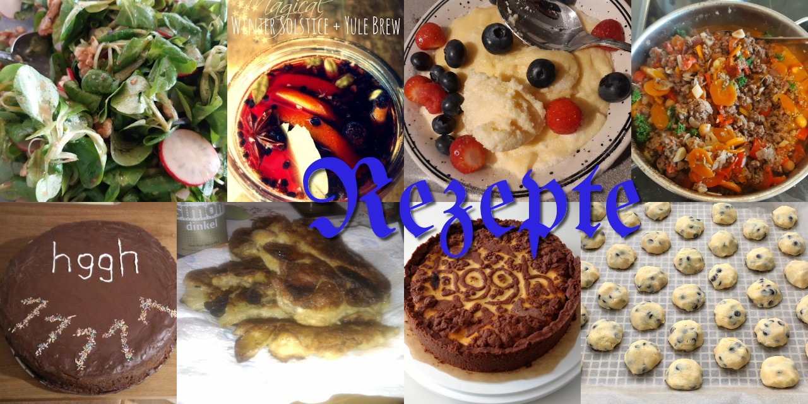

Rezeptesammlung
===============

❧ [nach Kategorie](tags/index.md) ❦ [nach Eigner](owner/index.md) ❦ [alle Rezepte](rezepte/index.md) ❧ [all English-language recipes](tags/English/index.md) ❣︎

Hallo!
Hier ist eine lose Rezeptesammlung, in der gute Rezepte abgelegt und wieder abgerufen werden können.

Alle Rezepte, die dem folgenden Konzept entsprechen, sind in dem Verzeichnis `rezepte` zu finden; alle anderen in dem Verzeichnis `uncategorised`.
Sie sind in Markdown (oder Klartext oder HTML) geschrieben und enthalten in der Regel eine oder mehrere Zutatenlisten und Anweisungen zur Ausführung des Rezepts.

Zu Beginn jeder Datei befinden sich Metadaten (owner und tags), die zur Katalogisierung genutzt werden.
Die Metadaten sehen so aus:
```yaml
---
owner: toerb
tags:
- Süßspeise
- Langsam
- Party
- Vegetarisch
---
```

Wichtig: das Format und die Reihenfolge muß präzise eingehalten werden, mit folgenden Ausnahmen:

* Statt `---` kann auch `<!--` und `-->` verwendet werden (hilfreich in HTML)
* Nach der `owner`-Zeile kann eine Zeile `name: NAME` eingefügt werden; dieser Name wird dann statt der ersten auf den Header folgenden Zeile (oder, falls leer, dem Dateibasisnamen) für den Index verwendet

Mit dem Skript `generate_catalog.sh` kann ein neuer Katalog auf Basis der Metadaten generiert werden.



[Kategorien](tags/index.md)
------------

[Ersteller](owner/index.md)
-----------

[Alle Rezepte](rezepte/index.md)
--------------
[all English-language recipes](tags/English/index.md)
