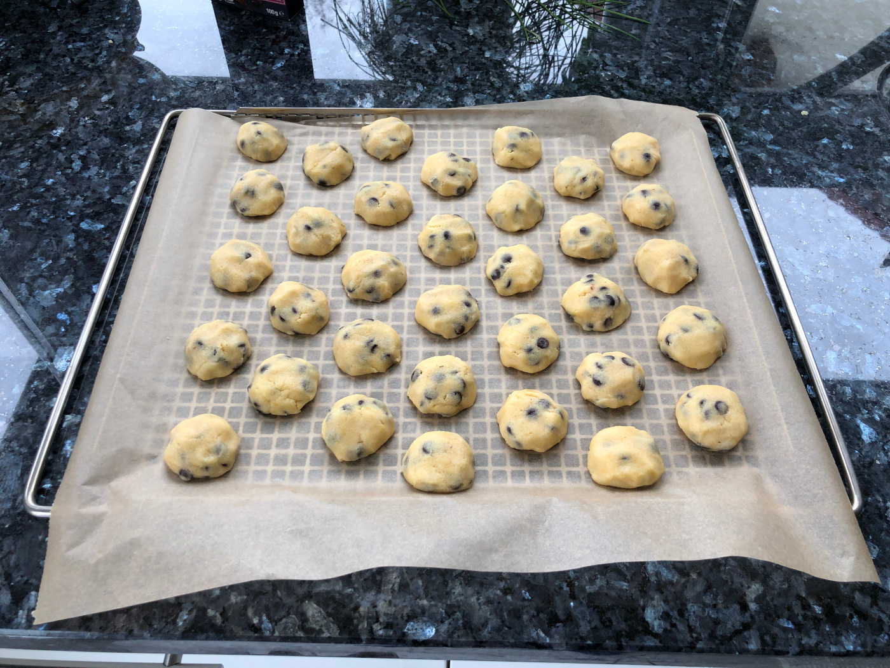

Rezepte von toerb
=====================

* [Chicken Tikka Masala](chicken_tikka_masala.md)
* [Crêpes](Crepes.md)
* [dampfnudeln](dampfnudeln.md)
* [erdbeer-cupcakes](erdbeer-cupcakes.md)
* [Französische Macarons mit Schokoladen- und Himbeerfüllung](macarons.md)

  
  
  
  
* [Gebrannte Mandeln](gebrannte_mandeln.md)
* [griesskloesschen](griesskloesschen.md)
* [johannisbeer_baiser_kuchen](johannisbeer_baiser_kuchen.md)
* [kuerbislasagne](kuerbislasagne.md)
* [kuerbismarmelade](kuerbismarmelade.md)
* [kuerbissuppe](kuerbissuppe.md)
* [Pesto](pesto.md)
* [Putenbruststreifen mit Dijonsenfsoße und Bandnudeln](putenbrust_dijonsenf.md)
* [Russischer Zupfkuchen](russischer_zupfkuchen.md)

  
* [Rüblitorte](rueblitorte.md)
* [Schokotröpfchen](schokotroepfchen.md)

  
* [Schwedische Zimtschnecken (Kanelbullar)](schwedische_zimtschnecken.md)
* [Spritzgebäck](spritzgebaeck.md)
* [Spätzle](Spaetzle.md)
* [tiramisu](tiramisu.md)
* [Waffeln (belgische Hefewaffeln)](hefewaffeln.md)
* [Zebrakuchen](zebrakuchen.md)
* [Zitronenlimonade](zitronenlimonade.md)
