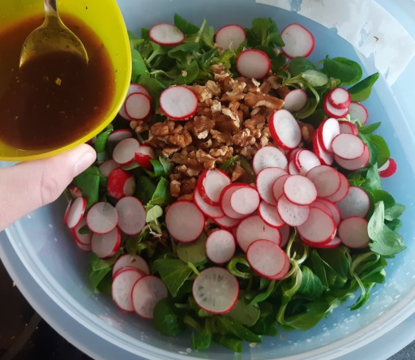
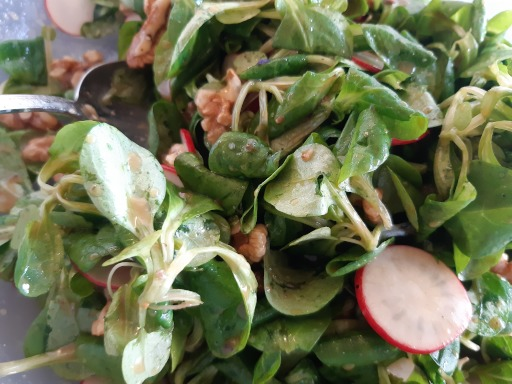
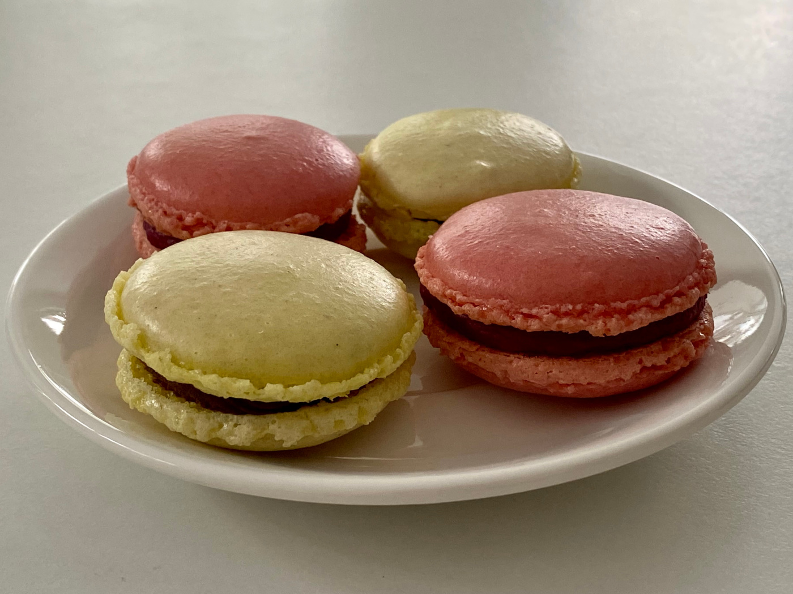
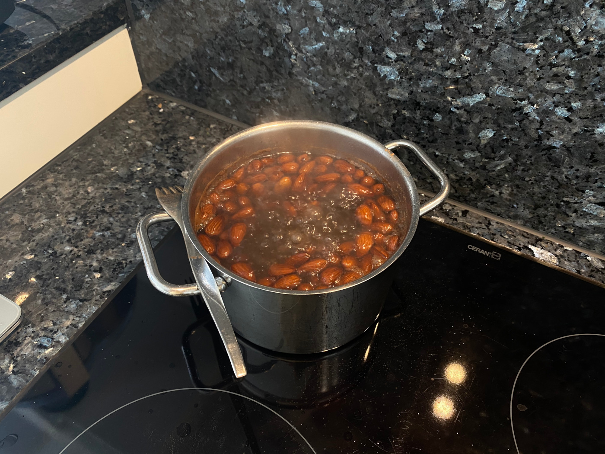
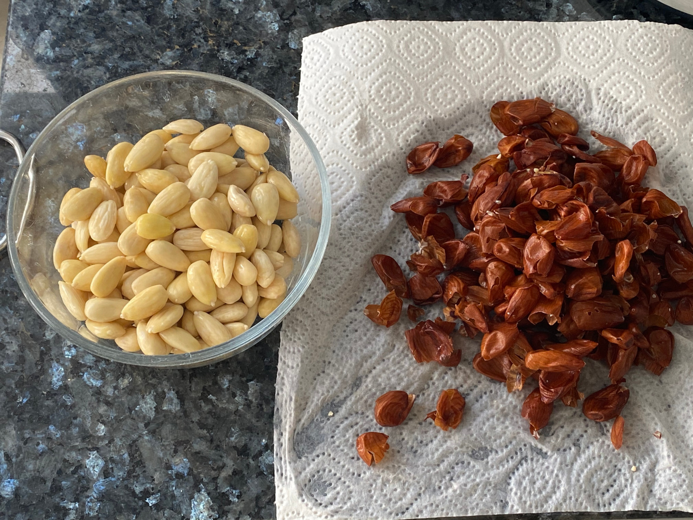
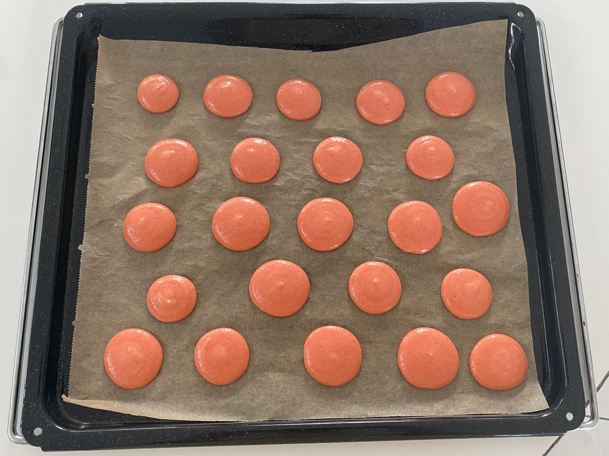
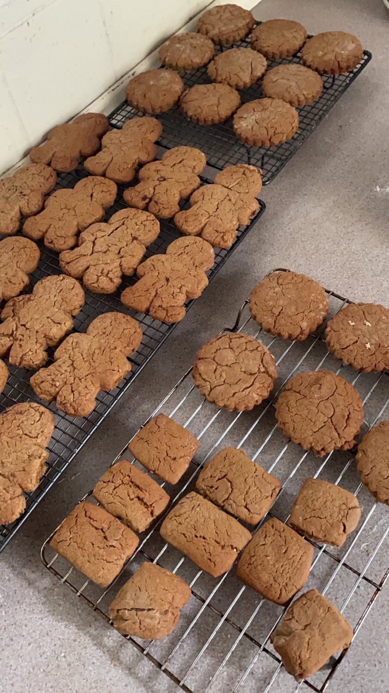
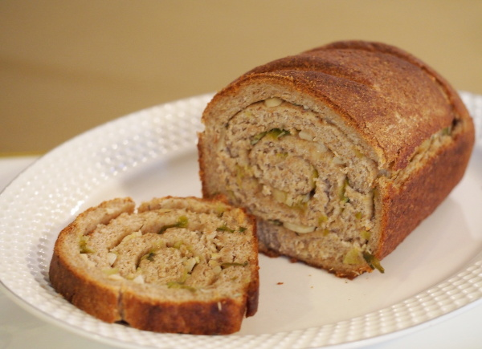

Alle Rezepte
=====================

* [American Apple Crumble](American-Apple-Crumble.md)
* [Amerikaner](Amerikaner.md)
* [Apfelkuchen](Apfelkuchen.txt)
* [Bienenstich](bienenstich.md)
* [Biermarinade](Biermarinade.txt)
* [Blaukraut](blaukraut.md)
* [Brownies](brownies.md)
* [Chicken Tikka Masala](chicken_tikka_masala.md)
* [Crêpes](Crepes.md)
* [Curry Geschnetzeltes](curry-geschnetzeltes.md)
* [dampfnudeln](dampfnudeln.md)
* [erdbeer-cupcakes](erdbeer-cupcakes.md)
* [Feldsalat mit Honig-Senf-Dressing](Feldsalat.txt)

  
  
* [Fladenbrot mit Zahtar](Fladenbrot-mit-Zahtar.txt)
* [Französische Macarons mit Schokoladen- und Himbeerfüllung](macarons.md)

  
  
  
  
* [Gebrannte Mandeln](gebrannte_mandeln.md)
* [gefüllte Paprika](gefuellte_paprika.md)
* [Gemüsenudeln](Gemuesenudeln.md)
* [Gemüsepfanne mit Reis](Gemüsepfanne+Reis.md)
* [Ginger Toms](GingerToms.md)

  
* [griesskloesschen](griesskloesschen.md)
* [Grießpudding (semolina pudding)](Grießpudding.txt)

  
  
  
* [Haferbratlinge mit Kidneybohnen](Haferbratlinge.txt)
* [Haferflockenbollen](Haferflockenbollen.md)
* [Haferkekse](Haferkekse.txt)
* [Hot toddy](hot_toddy.txt)
* [Hähnchenkeulen Tomaten Kartoffeln](haehnchen-tomaten-kartoffeln-backofen.md)
* [Ingwerdressing für Salat (ginger dressing for salad)](Ingwerdressing.txt)
* [johannisbeer_baiser_kuchen](johannisbeer_baiser_kuchen.md)
* [Kartoffelgratin](Kartoffelgratin.md)
* [Kartoffelsalat (mit Curry)](Kartoffelsalat.md)
* [Kartoffelsalat (Ǟəpelschlɔ̄t, Ärpelschloot)](Ǟəpelschlɔ̄t.htm)

  
* [kaszę gryczaną (Buchweizengrütze, buckwheat groats)](kaszę_gryczaną.txt)
* [Knoblauch-Brot mit Frühlingszwiebeln](Knoblauchbrot.txt)

  
* [Knoblauchsuppe](Knoblauchsuppe.txt)
* [kuerbislasagne](kuerbislasagne.md)
* [kuerbismarmelade](kuerbismarmelade.md)
* [kuerbissuppe](kuerbissuppe.md)
* [Käsekuchen](Käsekuchen.md)
* [Linzertorte](Linzertorte.md)
* [Muffins Schokolade mit Banane Vegan](vegan_schoki_bananen_muffins.md)
* [Muffins Schokolade Vegan](muffin_schokolade_vegan.md)
* [Möhrensuppe](Moehrensuppe.md)
* [Mürbeteig](Muerbeteig.md)
* [Müsli](muesli.md)
* [Noodles with twice meat](Noodles-twice-meat.txt)

  
* [Nussecken](Nussecken.md)
* [Overnight-Oats](Overnight-Oats.txt)
* [Paprikagemüse mit Reis](Paprikagemüse.txt)

  
* [Pesto](pesto.md)
* [Pfannkuchen (Hefepfannkuchen)](Pfannkuchen.htm)

  
* [Pizza](pizza.md)
* [Porridge „zuhause“](Porridge.txt)
* [Pudding](pudding.md)
* [Putenbruststreifen mit Dijonsenfsoße und Bandnudeln](putenbrust_dijonsenf.md)
* [Quiche Lorraine](quiche_lorraine.md)
* [Ratatouille](Ratatouille.txt)
* [Reis mit Kokonussmilch mit Curry](reis_kokosnussmilch_curry.md)
* [Reis/Hackfleisch/Tomaten Eintopf aka Reis-Schlonz](reis_hackfleisch_tomaten_eintopf.md)
* [Rosenkohl-Maroni-Gemüse](Rosenkohlmaroni.txt)
* [Rosenkohlpüree mit geschmelzten Zwiebeln](Rosenkohlpüree.txt)
* [Rote Paprika Süßkartoffel-Suppe](Suesskartoffelsuppe.md)
* [Russischer Zupfkuchen](russischer_zupfkuchen.md)

  
* [Rüblitorte](rueblitorte.md)
* [Safranmilch (saffron milk)](Safranmilch.txt)
* [Sahnebohnensuppe (vegetarisch)](Sahnebohnensuppe.txt)

  
* [Sauerteig (Weizen, einfach, TA 150)](Sauerteig.txt)
* [Schokoladentorte](Schokoladentorte.md)

  
* [Schokotröpfchen](schokotroepfchen.md)

  
* [Schwedische Zimtschnecken (Kanelbullar)](schwedische_zimtschnecken.md)
* [Skúffukaka (isländischer Schokoladenkuchen mit Lakritz)](Skúffukaka.txt)
* [Spritzgebäck](spritzgebaeck.md)
* [Spätzle](Spaetzle.md)
* [Tiramisu](tiramisu.md)
* [Tiroler Nusskuchen](tiroler_nusskuchen.md)
* [Uncle Bubba’s Peanut Butter Soup](groundnut_stew.txt)
* [Waffeln (Apfel-Hafer-Vollkorn)](Waffeln_Apfel-Hafer-Vollkorn.md)

  
* [Waffeln (belgische Hefewaffeln)](hefewaffeln.md)
* [Waffeln „klassisch“](waffeln.md)
* [Winter Solstice + Yule Brew](Solstice+Yule_Brew.txt)

  
* [Zebrakuchen](zebrakuchen.md)
* [Zichorien-Orangensalat](Zichorien-Orangensalat.txt)
* [Zimtkekse (Nervenkekse) der heiligen Hildegard von Bingen](Zimtkekse.txt)
* [Zitronenkuchen](zitronenkuchen.md)
* [Zitronenlimonade](zitronenlimonade.md)
