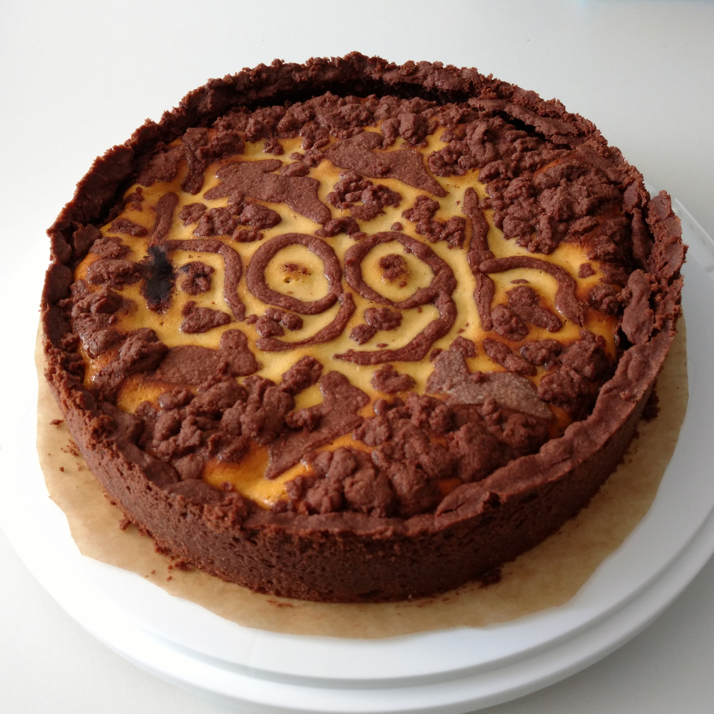

Alle Rezepte
=====================

* [Amerikaner](Amerikaner.md)
* [Bienenstich](bienenstich.md)
* [Biermarinade](Biermarinade.txt)
* [Blaukraut](blaukraut.md)
* [Brownies](brownies.md)
* [Crêpes](Crepes.md)
* [Curry Geschnetzeltes](curry-geschnetzeltes.md)
* [Feldsalat mit Honig-Senf-Dressing](Feldsalat.txt)

  
  
* [Fladenbrot mit Zahtar](Fladenbrot-mit-Zahtar.txt)
* [gefüllte Paprika](gefuellte_paprika.md)
* [Gemüsenudeln](Gemuesenudeln.md)
* [Gemüsepfanne mit Reis](Gemüsepfanne+Reis.md)
* [Grießpudding](Grießpudding.txt)

  
  
  
* [Haferflockenbollen](Haferflockenbollen.md)
* [Hähnchenkeulen Tomaten Kartoffeln](haehnchen-tomaten-kartoffeln-backofen.md)
* [Ingwerdressing für Salat (ginger dressing for salad)](Ingwerdressing.txt)
* [Kartoffelgratin](Kartoffelgratin.md)
* [Kartoffelsalat](Kartoffelsalat.md)
* [Muffins Schokolade mit Banane Vegan](vegan_schoki_bananen_muffins.md)
* [Muffins Schokolade Vegan](muffin_schokolade_vegan.md)
* [Möhrensuppe](Moehrensuppe.md)
* [Mürbeteig](Muerbeteig.md)
* [Müsli](muesli.md)
* [Noodles with twice meat](Noodles-twice-meat.txt)

  
* [Paprikagemüse mit Reis](Paprikagemüse.txt)

  
* [Pesto](pesto.md)
* [Pfannkuchen (Hefepfannkuchen)](Pfannkuchen.htm)

  
* [Pizza](pizza.md)
* [Porridge „zuhause“](Porridge.txt)
* [Pudding](pudding.md)
* [Putenbruststreifen mit Dijonsenfsoße und Bandnudeln](putenbrust_dijonsenf.md)
* [Quiche Lorraine](quiche_lorraine.md)
* [Ratatouille](Ratatouille.txt)
* [Reis mit Kokonussmilch mit Curry](reis_kokosnussmilch_curry.md)
* [Reis/Hackfleisch/Tomaten Eintopf aka Reis-Schlonz](reis_hackfleisch_tomaten_eintopf.md)
* [Rosenkohl-Maroni-Gemüse](Rosenkohlmaroni.txt)
* [Rosenkohlpüree mit geschmelzten Zwiebeln](Rosenkohlpüree.txt)
* [Russischer Zupfkuchen](russischer_zupfkuchen.md)

  
* [Safranmilch (saffron milk)](Safranmilch.txt)
* [Sahnebohnensuppe (vegetarisch)](Sahnebohnensuppe.txt)
* [Schokoladentorte](Schokoladentorte.md)

  
* [Schokotröpfchen](schokotroepfchen.md)

  
* [Schwedische Zimtschnecken (Kanelbullar)](schwedische_zimtschnecken.md)
* [Spritzgebäck](spritzgebaeck.md)
* [Spätzle](Spaetzle.md)
* [Tiroler Nusskuchen](tiroler_nusskuchen.md)
* [Uncle Bubba’s Peanut Butter Soup](groundnut_stew.txt)
* [Waffeln](waffeln.md)
* [Winter Solstice + Yule Brew](Solstice+Yule_Brew.txt)

  
* [Zebrakuchen](zebrakuchen.md)
* [Zichorien-Orangensalat](Zichorien-Orangensalat.txt)
* [Zimtkekse (Nervenkekse) der heiligen Hildegard von Bingen](Zimtkekse.txt)
* [Zitronenkuchen](zitronenkuchen.md)
* [Zitronenlimonade](zitronenlimonade.md)
