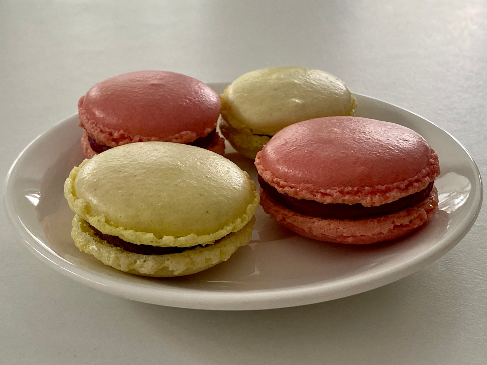
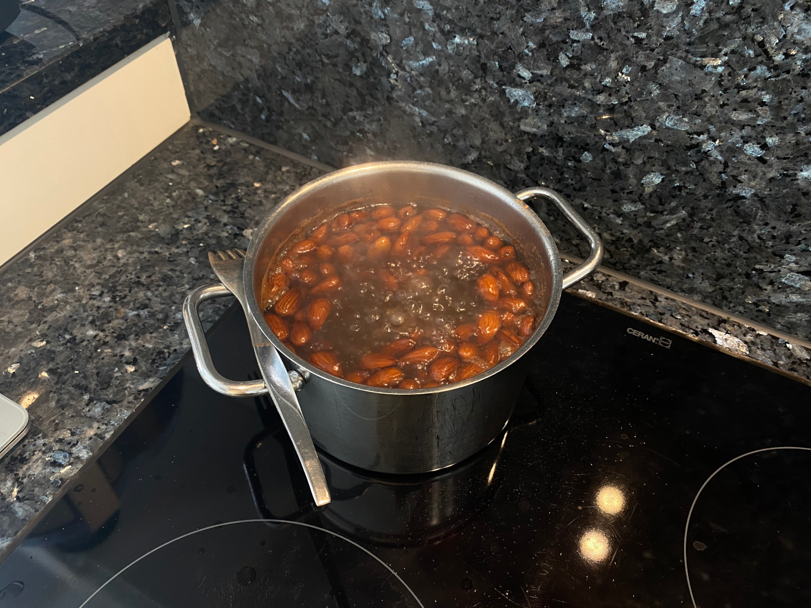

Französische Macarons mit Schokoladen- und Himbeerfüllung
=========================================================

Das Macaron ist eine Art süßer, französischer Doppelkeks mit einem Durchmesser von drei bis fünf Zentimetern :straight_ruler:.
Es besteht hauptsächlich aus zwei mit Lebensmittelfarbe gefärbten Schalen und einer sehr intensiv schmeckenden Füllung :yum:.
Durch die aufwändige Herstellung sind Macarons in der Regel Handarbeit und werden im Verkauf auch entsprechend bepreist :money_with_wings:.
Zum Glück können sie auch selbst auf Vorrat hergestellt und im Anschluss portionsweise eingefroren werden :wink:.

## Die Schalen
Wie eine deutsche Makrone, bestehen die Schalen der Macarons aus einem Mandelbaiser.
Die Schale an sich ist dabei nur luftig süß und haben kein oder nur wenig Eigengeschmack.
Gefärbt werden die Schalen mit Lebensmittelfarbe, am besten in Pulverform.

### Zutaten für 24 Macarons (48 Schalen)
* 135 g fein gemahlene, blanchierte Mandeln
* 225 g Puderzucker
* 105-110 g Eiweiß
* 30 g Zucker
* nach Belieben Lebensmittelfarbe in Pulverform

### Zubereitung
Für die Herstellung von Macarons benötigt man sehr fein gemahlene, blanchierte Mandeln.
Im Supermarkt erhält man diesen Mahlgrad in der Regel nicht.
Deshalb kann man entweder die feinsten, blanchierten Mandeln kaufen, die man finden kann, oder man blanchiert selbst.
Wie das geht, steht weiter unten auf dieser Seite im [Exkurs: Mandeln blanchieren](#exkurs-mandeln-blanchieren).
Wichtig ist, dass das Gewicht der Mandeln erst nach dem Häuten und Trocknen gemessen wird.

Die Mandeln müssen im Anschluss sehr fein gemahlen werden.
Damit das funktioniert und kein Mandelmus entsteht, geben wir ca. die Hälfte des Puderzuckers bereits vor dem Mahlen hinzu.
Im Anschluss an den Mahlvorgang wird der restliche Puderzucker hinzugegeben und vermengt.
Dieses Gemisch wird zum Auflockern durch ein grobes Metallsieb in eine Schüssel gesiebt.

Das abgewogene Eiweiß wird in einer weiteren Schüssel geschlagen.
Sobald das Eiweiß anfängt zu schäumen, wird der Zucker zugegeben.
Als nächstes wird so viel Lebensmittelfarbe untergerührt, bis der ehemals weiße Schaum die gewünschte Farbe erreicht hat.
Sobald das Baiser fest und stabil ist, kann mit Rühren aufgehört werden.

Nun kann nach und nach ungefähr je ein Viertel des Mandel-Zucker-Gemischs unter das Baiser gehoben werden.
Dafür wird das Baiser solange mit einem Teigschaber mit dem Gemisch vermengt, bis es eine homogene Masse ist.
Das Ergebnis sollte immer noch luftig und eher zähflüssig sein.

Die Baisermasse wird in einen stabilen Spritzbeutel mit einer kleinen Lochtülle gegeben.
Mit Hilfe des Spritzbeutels werden auf Backpapier ca. 2,5 cm große Kreise gesetzt.
Die Teigkreise sollten etwas Platz um sich herum haben, da sie noch etwas verlaufen werden.

Der Ofen kann nun auf 145 °C Ober-/Unterhitze vorgeheizt werden.
Nachdem die ersten Schalen 30 Minuten geruht haben, können sie auf einem dicken Backblech für 19 Minuten gebacken werden.
Danach werden die Schalen mit dem Backpapier vom Blech geholt und können auf einer Arbeitsfläche auskühlen.
So werden alle Schalen, Blech für Blech, ausgebacken.
Nach mindestens zehn Minuten Abkühlzeit können die Schalen vorsichtig vom Backpapier gelöst werden.

## Die Füllung
Für die Füllung der Macarons werden häufig [Ganaches](https://de.wikipedia.org/wiki/Ganache) oder [Buttercremes](https://de.wikipedia.org/wiki/Buttercreme) eingesetzt, in die Zutaten für den gewünschten Geschmack eingearbeitet werden.
Da die Schalen bereits sehr süß sind, kann hier auf Zucker weitestgehend verzichtet werden.

### Schokoladenfüllung
#### Zutaten für 24 Macarons
* 120 g Zartbitterschokolade
* 110 g Sahne
* 25 g weiche Butter

#### Zubereitung
Damit die Schokoladenfüllung gut gelingt, muss die Schokolade möglichst fein gehackt werden.
Die Sahne wird dann in einem Topf auf dem Herd kurz aufgekocht und dann zur Schokolade gegeben.
Diese Gemenge wird nun mit der weichen Butter gut verrührt, bis sich eine homogene Masse bildet.

### Himbeerfüllung
#### Zutaten für 24 Macarons
* 100 g dickes, passiertes Himbeerpüree
* 200 g weiße Schokolade

#### Zubereitung
Um das benötigte Himbeerpüree herzustellen, verwende ich ungefähr die dreifache Menge an tiefgekühlten Himbeeren.
Diese werden in einem Topf eingekocht und mit einem Mixstab püriert.
Da Himbeeren sehr viele harte Samen enthalten, wird das Püree nun noch durch ein dichtes Metallsieb gedrückt.

Zusammen mit der weißen Schokolade kann das Himbeerpüree in einem Wasserbad erhitzt werden.
Sobald die Schokolade warm genug ist, können die beiden Zutaten zu einer homogenen Masse vermengt werden.
Nach ein paar Stunden sollte die Füllung genug abgekühlt sein, um weiterverarbeitet werden zu können.

### Auftragen der Füllung
Nachdem die Füllung abgekühlt ist, sollte sie eine feste Konsistenz haben.
Für das Auftragen auf die Schalen wird die Füllung in einen Spritzbeutel mit einer gezackten Tülle gefüllt.
Die bereits paarweise nach ihrer Größe gruppierten Schalen werden dann einseitig mit der Füllung belegt und dann leicht zusammengepresst.

## Das Ergebnis
Die fertigen Macarons können jetzt entweder im Kühlschrank aufbewahrt oder direkt eingefroren werden.
Sie müssen aber auf jeden Fall vor dem Verzehr noch einen Tag ziehen, damit sie ihren Geschmack entfalten.
Zum Auftauen können die Macarons einfach über Nacht in den Kühlschrank gelegt werden.
Je nach Anlass würde ich unterschiedliche Verpackungsgrößen wählen, von ganz wenige (2-4 Stück), bis viele (10-12 Stück).
Auf diese Weise kann man nach einem erfolgreichen Backtag mehrere Wochen vom Macaronvorrat im Tiefkühlschrank zehren.

## Exkurs: Mandeln blanchieren
Um Mandeln von ihrer Haut zu befreien, kann man sie blanchieren, also für kurze Zeit in heißes Wasser geben.
Dafür wird ein Topf mit reichlich Wasser aufgesetzt und zum Kochen gebracht.
Darin werden die Mandeln mit Haut für circa drei Minuten gekocht.

Nach dieser Zeit werden die Mandeln in ein Sieb gegossen und mit kaltem Wasser abgeschreckt.
Nun lassen sich die Mandeln ganz einfach häuten, indem man mit der einen Hand ein kleines Loch in die Haut macht und die Mandel dann ausdrückt.
Zurück bleibt zum einen die Haut, die danach entsorgt werden kann, und zum anderen die gehäuteten Mandeln.

Bevor die gehäuteten Mandeln weiterverarbeitet werden, sollten sie noch getrocknet werden.
Dafür können sie, auf ein Backpapier ausgebreitet, für 15-20 Minuten bei ungefähr 80 °C in den Ofen gegeben werden.
