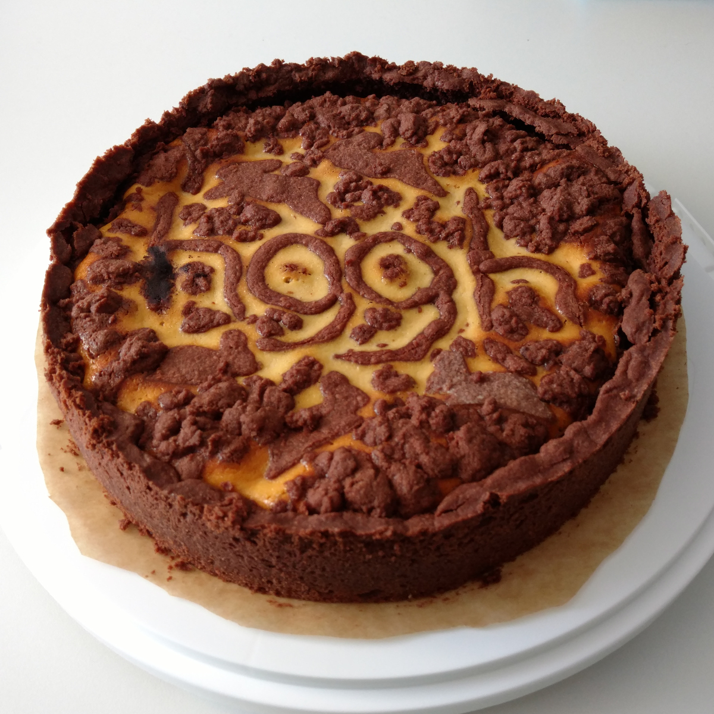
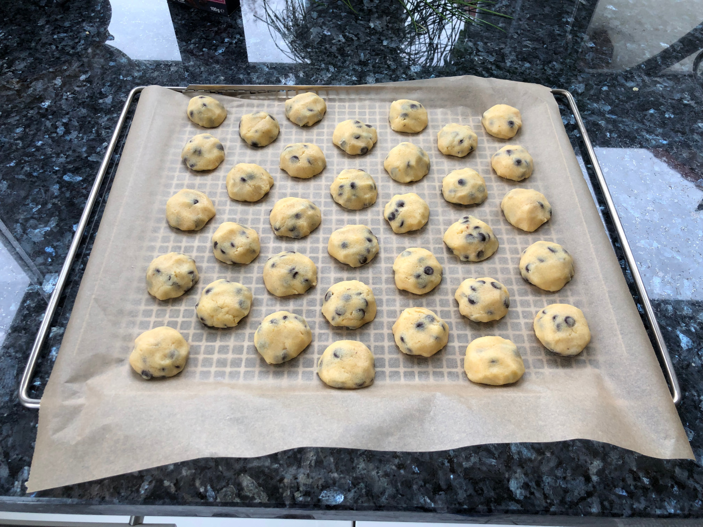

Rezepte für Backen
=====================

* [Amerikaner](Amerikaner.md)
* [Apfelkuchen](Apfelkuchen.txt)
* [Bienenstich](bienenstich.md)
* [Brownies](brownies.md)
* [Fladenbrot mit Zahtar](Fladenbrot-mit-Zahtar.txt)
* [Haferflockenbollen](Haferflockenbollen.md)
* [Haferkekse](Haferkekse.txt)
* [Muffins Schokolade mit Banane Vegan](vegan_schoki_bananen_muffins.md)
* [Muffins Schokolade Vegan](muffin_schokolade_vegan.md)
* [Mürbeteig](Muerbeteig.md)
* [Pizza](pizza.md)
* [Quiche Lorraine](quiche_lorraine.md)
* [Russischer Zupfkuchen](russischer_zupfkuchen.md)

  
* [Sauerteig (Weizen, einfach, TA 150)](Sauerteig.txt)
* [Schokoladentorte](Schokoladentorte.md)

  
* [Schokotröpfchen](schokotroepfchen.md)

  
* [Schwedische Zimtschnecken (Kanelbullar)](schwedische_zimtschnecken.md)
* [Skúffukaka (isländischer Schokoladenkuchen mit Lakritz)](Skúffukaka.txt)
* [Spritzgebäck](spritzgebaeck.md)
* [Tiroler Nusskuchen](tiroler_nusskuchen.md)
* [Zebrakuchen](zebrakuchen.md)
* [Zimtkekse (Nervenkekse) der heiligen Hildegard von Bingen](Zimtkekse.txt)
* [Zitronenkuchen](zitronenkuchen.md)
