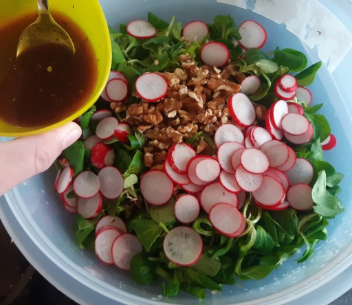

Rezepte für Beilage
=====================

* [Biermarinade](Biermarinade.txt)
* [Blaukraut](blaukraut.md)
* [Feldsalat mit Honig-Senf-Dressing](Feldsalat.txt)

  
  
* [Fladenbrot mit Zahtar](Fladenbrot-mit-Zahtar.txt)
* [Gemüsenudeln](Gemuesenudeln.md)
* [Haferbratlinge mit Kidneybohnen](Haferbratlinge.txt)
* [Ingwerdressing für Salat (ginger dressing for salad)](Ingwerdressing.txt)
* [Kartoffelsalat (mit Curry)](Kartoffelsalat.md)
* [Kartoffelsalat (Ǟəpelschlɔ̄t, Ärpelschloot)](Ǟəpelschlɔ̄t.htm)

  
  
  
  
  
  
  
  
  
  
  
* [kaszę gryczaną (Buchweizengrütze, buckwheat groats)](kaszę_gryczaną.txt)
* [Knoblauch-Brot mit Frühlingszwiebeln](Knoblauchbrot.txt)

  
* [Pesto](pesto.md)
* [Rosenkohlpüree mit geschmelzten Zwiebeln](Rosenkohlpüree.txt)
* [Spätzle](Spaetzle.md)
* [Zichorien-Orangensalat](Zichorien-Orangensalat.txt)
