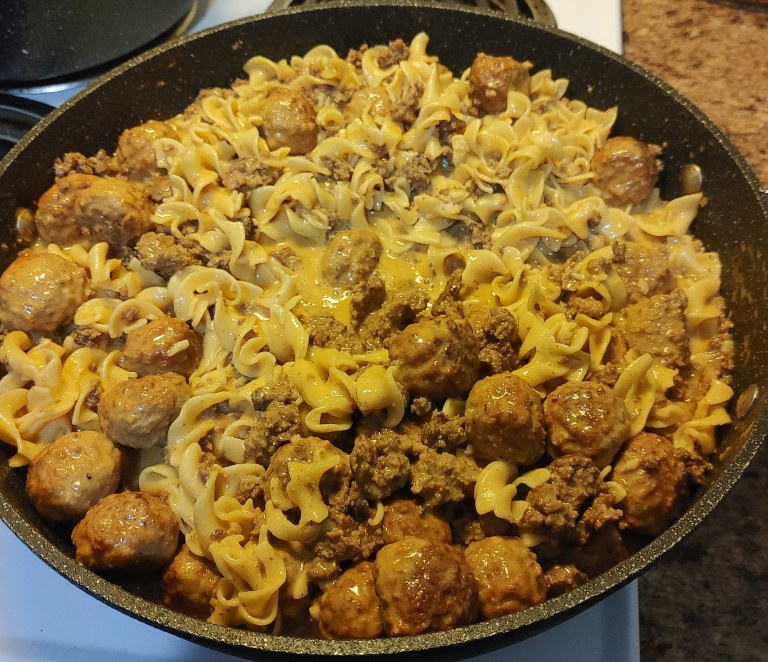
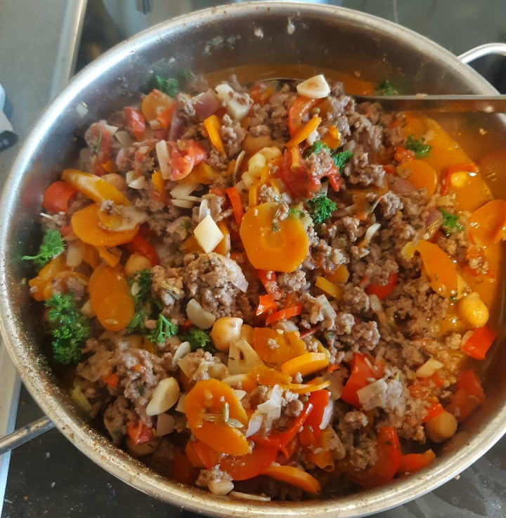
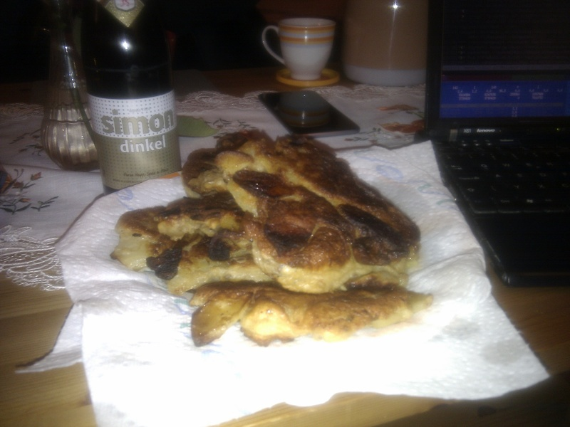

Rezepte für Hauptgericht
=====================

* [Curry Geschnetzeltes](curry-geschnetzeltes.md)
* [gefüllte Paprika](gefuellte_paprika.md)
* [Hähnchenkeulen Tomaten Kartoffeln](haehnchen-tomaten-kartoffeln-backofen.md)
* [Möhrensuppe](Moehrensuppe.md)
* [Noodles with twice meat](Noodles-twice-meat.txt)

  
* [Paprikagemüse mit Reis](Paprikagemüse.txt)

  
* [Pfannkuchen (Hefepfannkuchen)](Pfannkuchen.htm)

  
* [Pizza](pizza.md)
* [Putenbruststreifen mit Dijonsenfsoße und Bandnudeln](putenbrust_dijonsenf.md)
* [Quiche Lorraine](quiche_lorraine.md)
* [Ratatouille](Ratatouille.txt)
* [Reis mit Kokonussmilch mit Curry](reis_kokosnussmilch_curry.md)
* [Reis/Hackfleisch/Tomaten Eintopf aka Reis-Schlonz](reis_hackfleisch_tomaten_eintopf.md)
* [Rosenkohl-Maroni-Gemüse](Rosenkohlmaroni.txt)
* [Sahnebohnensuppe (vegetarisch)](Sahnebohnensuppe.txt)
* [Uncle Bubba’s Peanut Butter Soup](groundnut_stew.txt)
* [Waffeln](waffeln.md)
