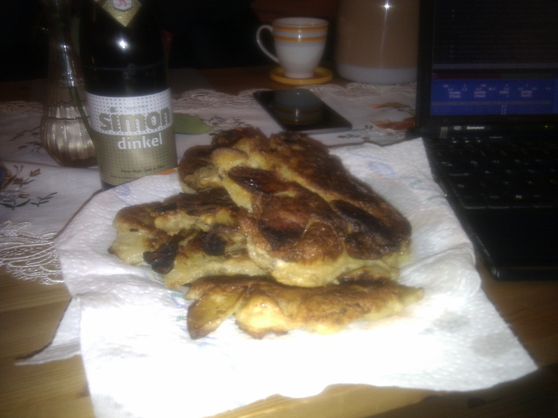

Rezepte für Party
=====================

* [Crêpes](Crepes.md)
* [Pfannkuchen (Hefepfannkuchen)](Pfannkuchen.htm)

  
* [Porridge „zuhause“](Porridge.txt)
* [Sahnebohnensuppe (vegetarisch)](Sahnebohnensuppe.txt)
* [Winter Solstice + Yule Brew](Solstice+Yule_Brew.txt)

  
