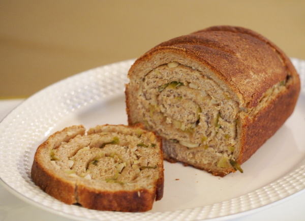

Rezepte für Party
=====================

* [Crêpes](Crepes.md)
* [Kartoffelsalat (Ǟəpelschlɔ̄t, Ärpelschloot)](Ǟəpelschlɔ̄t.htm)

  
* [Knoblauch-Brot mit Frühlingszwiebeln](Knoblauchbrot.txt)

  
* [kuerbislasagne](kuerbislasagne.md)
* [kuerbismarmelade](kuerbismarmelade.md)
* [kuerbissuppe](kuerbissuppe.md)
* [Pfannkuchen (Hefepfannkuchen)](Pfannkuchen.htm)

  
* [Porridge „zuhause“](Porridge.txt)
* [Sahnebohnensuppe (vegetarisch)](Sahnebohnensuppe.txt)

  
* [Waffeln (Apfel-Hafer-Vollkorn)](Waffeln_Apfel-Hafer-Vollkorn.md)

  
* [Winter Solstice + Yule Brew](Solstice+Yule_Brew.txt)

  
