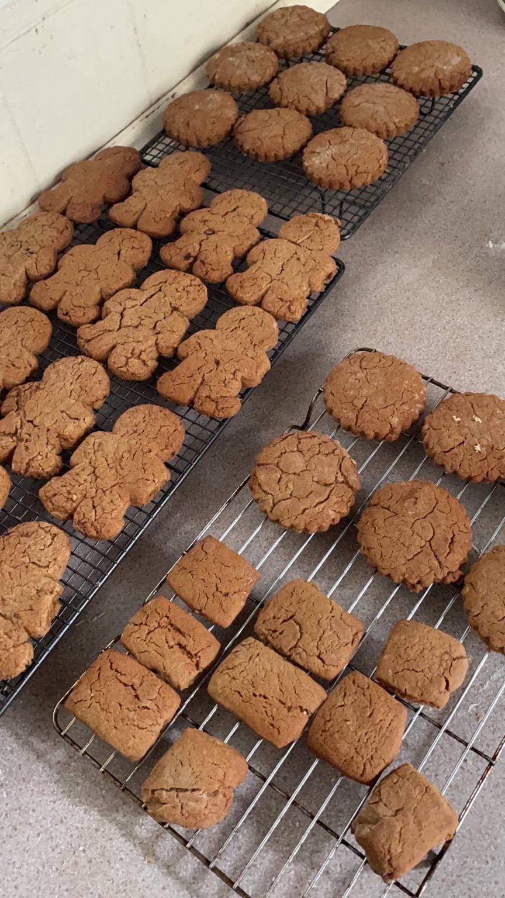

Rezepte für Plätzchen
=====================

* [Ginger Toms](GingerToms.md)

  
* [Haferkekse](Haferkekse.txt)
* [Schokotröpfchen](schokotroepfchen.md)

  
* [Spritzgebäck](spritzgebaeck.md)
* [Zimtkekse (Nervenkekse) der heiligen Hildegard von Bingen](Zimtkekse.txt)
