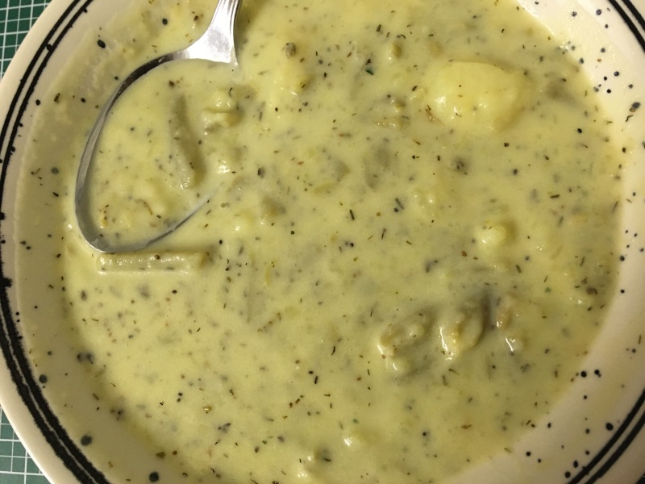

Rezepte für Winter
=====================

* [Gebrannte Mandeln](gebrannte_mandeln.md)
* [Porridge „zuhause“](Porridge.txt)
* [Safranmilch (saffron milk)](Safranmilch.txt)
* [Sahnebohnensuppe (vegetarisch)](Sahnebohnensuppe.txt)

  
* [Winter Solstice + Yule Brew](Solstice+Yule_Brew.txt)

  
